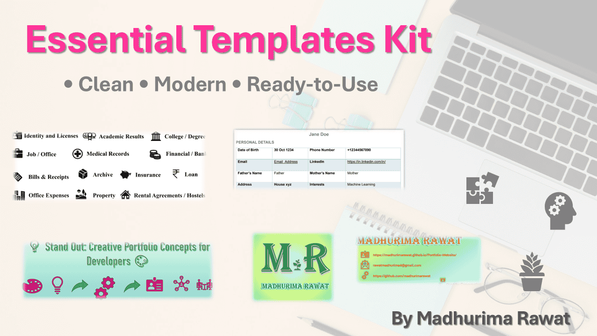

# ✨ Essential Templates Kit

<p align="center">
</p>

<p align="center">
  A curated collection of clean, modern, and ready-to-use templates for developers, creators, and students.
</p>

<p align="center">
  🚀 Build faster • 🎨 Design smarter • 📂 Stay organized
</p>

---

## 📦 What's Inside

✨ A growing collection of:

* 📄 **Resume Templates** – Professional & minimal
* 🖼️ **Dev.to Covers** – Clean blog visuals
* 🎨 **Portfolio Cards** – Modern UI components
* 📺 **YouTube Assets** – Logos & visuals
* 🗂️ **Document Organization** – Smart printable systems
* 🔖 **Logos & Design Assets**

---

## 📁 Folder Structure

```bash
Essential-Templates-Kit/
│
├── Resume_Templates/
├── Dev-to Posts_Cover_Image/                     # Cover images for blog posts
│       ├── Aquascript 🌊                    # Aquascript series cover images
│       │   └── Aquascript inside Dev
│       │       Cover Image 1000×420.pptx 💧 # Specific Aquascript cover image file
│       ├── Series 📚                        # Series of Localstack cover images
│       │   └── Series Localstack Dev
│       │       Cover Image 1000×420.pptx 👩‍💻 # Specific Series cover image file
│       └── Widescreen 🖥️                    # Widescreen format cover images
│           └── Widescreen Dev Cover
│               Image Widescreen.pptx 🖥     # Specific Widescreen cover image file
├── Personal_Logo/
├── Youtube_Channel_Logo/
├── Document_Organization/
```

## 📂 Folder Descriptions

* 📄 **Resume Templates** – Includes two formats: a sleek, modern resume for compact professional presentation and a traditional biodata format for detailed personal information.

* 🖼️ **Dev.to Cover Images** – Minimal and clean cover designs optimized for technical blog posts and readability.

  Resources and visuals for my articles on [dev.to](https://dev.to).

  * 🌊 `Aquascript`: Aquascript series cover images including a specific file `Aquascript inside Dev Cover Image 1000×420.pptx`.
  * 📚 `Series`: Series of Localstack cover images with `Series Localstack Dev Cover Image 1000×420.pptx`.
  * 🖥️ `Widescreen`: Widescreen format cover images with `Widescreen Dev Cover Image Widescreen.pptx`.


* 🎨 **Personal Logo** – Simple and aesthetic logo designs suitable for personal branding and portfolio identity.

* 📺 **YouTube Channel Logo** – Ready-to-use channel logo templates designed for clear visibility and branding.

* 🗂️ **Document Organization** – Printable templates and structured layouts to help organize documents efficiently and neatly.

---

## 🎯 Who is this for?

✔ Students building portfolios
✔ Developers showcasing projects
✔ Creators designing content
✔ Anyone who loves aesthetic organization

---

## 🚀 How to Use

1. Browse the folders
2. Choose your template
3. Download or clone
4. Customize as needed

---

## ⭐ Show Your Support

If this helped you, give it a ⭐ and share with others!

---

## 👩‍💻 Author

**Madhurima Rawat**
Building useful + aesthetic things ✨

### 🔗 Connect with Me

* 💼 LinkedIn: [madhurima-rawat](https://www.linkedin.com/in/madhurima-rawat)
* 📧 Email: [rawatmadhurima4@gmail.com](mailto:rawatmadhurima4@gmail.com)

Open to collaboration, ideas, and creative projects ✨

<p align="center">
  Made with 💙 and a love for organization
</p>
